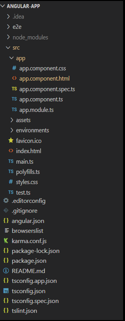

## Angular CLI

The [Angular CLI](https://cli.angular.io/) is a command-line interface for Angular that helps us to get started with creating an Angular application. Angular CLI creates an Angular application and uses the [Typescript](./modules/typescript/README.md) programming language, [Webpack](./webpack.md) for Module bundling, Karma for unit testing, and Protractor for end-to-end testing. The Angular CLI takes care of the configuration and initialization of various libraries. It also allows us to add components, directives, services, etc, to already existing Angular applications.

### Installing Angular CLI

Before installing Angular CLI, make sure the development environment includes Node.js and an npm package manager.

* Run the command `npm install -g @angular/cli` on the terminal to install the Angular CLI using npm.

* Run the CLI command `ng new my-app` to create a new angular app with the `my-app` name.

* The Angular CLI includes a server so that we can easily build and serve your app locally. First, go to the `my-app` workspace folder and Launch the server by using the CLI command `ng serve --open`.

The ng serve command launches the server on HTTP port 4200, which watches our files and rebuilds the app as we make changes to those files. The --open (or just -o) option automatically opens the browser to http://localhost:4200.

After running the `ng server -o` command, we will see:

## Angular File Structure

Generally, We use Visual Studio Code or Webstrom as a Code Editor for creating and editing Angular Applications. You can download and install Visual Studio Code from this website: [https://code.visualstudio.com/download](https://code.visualstudio.com/download)

The file structure of the Angular application described below:

The **e2e** folder at the top level contains source files for a set of end-to-end tests and test-specific configuration files. The **node_modules** folder provides npm packages to the entire workspace. The **src** folder contains the source files which give information about application logic, data, and assets.

* **app** - this folder contains the component files.

	* **app.component.ts** - used to define the logic for the app's root component (AppComponent). 

    * **app.component.html** - used to define the HTML template associated with the root AppComponent.

    * **app.component.css** - used to define the base CSS stylesheet for the root AppComponent.

    * **app.component.spec.ts** - used to define the unit test for the root AppComponent.

    * **app.module.ts** - used to define the root module (AppModule) and helps the Angular to assemble the application. All components, including the AppComponent, must be declared inside the AppModule.

* **assets** - this folder contains image and other asset files.

* **environments**  - this folder contains build configuration options for particular target environments. 

* **favicon.ico** - An icon to used for an application in the bookmark bar.

* **index.html** - The main HTML page that is served when someone visits your site. The CLI automatically adds all JavaScript and CSS files when building your app, so you typically don't need to add any `<script>` or `<link>` tags here manually.

* **main.ts** -	The main entry point for an application. Compiles the application with the JIT compiler and bootstraps the application's root module (AppModule) to run in the browser. 

* **polyfills.ts** - Provides polyfill scripts for browser support.

* **styles.css** - Lists CSS files that applies the styles for a project. 

* **test.ts** - The main entry point for unit tests used in the application.

* **.editorconfig** - this file contains configuration for code editors.

* **.gitignore** - it specifies untracked files that Git should ignore.

* **angular.json** - holds CLI configuration defaults for all projects in the workspace. It includes configuration options for the build, serve, and test tools.

* **browserslist** - used to configure the sharing of target browsers and Node.js versions among various front-end tools. 

* **karma.conf.js** - it contains application-specific Karma configuration.

* **package-lock.json** - this provides version information for all packages installed into node_modules by the npm client.
 
* **package.json** - used to configure npm package dependencies that are available to all projects in the workspace. 

* **README.md** - An introductory documentation for the root app.

* **tsconfig.app.json** - it holds application-specific TypeScript configuration, including TypeScript and Angular template compiler options. 

* **tsconfig.json** - holds default TypeScript configuration for projects in the workspace.

* **tslint.json** - holds default TSLint configuration for projects in the workspace. TSLint is an extensible static analysis tool that checks TypeScript code for readability, maintainability, and functionality errors. 

## References

* [Angular Docs - CLI Overview and Command Reference](https://angular.io/cli)
* [Angular Docs - Workspace and project file structure](https://angular.io/guide/file-structure)
