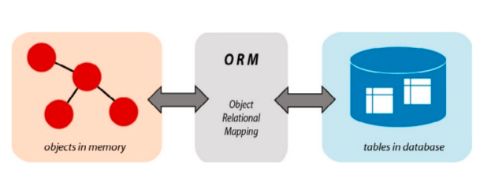

# Object Relational Mapping (ORM) 

Most object-oriented applications use a relational database to store and manage the application data. The relational database represents data in a table, whereas the data in object-oriented applications encapsulated in an object.

We can access a class by using its objects. However, to access the tabular data, we need to use a query language. Using tabular data in an object-oriented application requires a conversion between the two types of data.

As a result, it is not possible to store the objects directly in a relational database. These differences between object-oriented and relational database paradigms are called **impedance mismatch**.

[Impedance Mismatch](https://en.wikipedia.org/wiki/Object-relational_impedance_mismatch) can exist at the following points:

* **Granularity** - refers to the mismatch in the number of classes that are mapped with a certain number of tables in the database.
 
* **Inheritance** - Java classes in the application are commonly related to each other through an inheritance hierarchy. However, the tables within the database can't be represented through an inheritance hierarchy.
 
* **Identity** - The relational database distinguishes an object instance on the basis of their primary key. However, an object model distinguishes an object on the basis of object identity and object equality.

* **Association** - In the object model, two classes are linked by association. However, in relational databases, the linking of tables is achieved with the help of foreign keys.
 
* **Navigation** - The ways of accessing objects in Java and in RDBMS are fundamentally different.

To solve the impedance mismatch, we use an **ORM** tool that converts the **data between relational databases and object oriented programming languages**.

[ORM](https://en.wikipedia.org/wiki/Object-relational_mapping) stands for **O**bject-**R**elational **M**apping, uses objects to connect the Object-Oriented programming language and the database systems, which facilitates the SQL to work along with the object-oriented programming concepts. 

### Benefits of ORM

* ORM maps an object to the table.
* We can hide the details of SQL queries from OO logic. This propagates the idea of data abstraction.
* It provides methods for automatic versioning and timestamping.
* It provides caching support for better performance.
* Best suited for large projects
* Injected transaction management
* Configurable logging
* Faster development of applications

There are lots of ORM tools available such as Hibernate, JPA, Active JPA, iBATIS, IBM Pure Query, etc.

## References

* [What is Object/Relational Mapping?](https://hibernate.org/orm/what-is-an-orm/)
